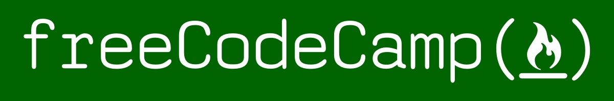

# freeCodeCamp Curriculum

Le site freecodecamp propose toute une série de certifications qui permettent d'acquérir les compétences requises pour prétendre à un poste de développeur frontend.\
Chaque langage ou librairie à connaître fait l'objet d'un ensemble de cours sous forme de questions ou de mini-projets qui font le tour des bases nécessaires à connaître dans la techno visée.\
5 mini projets encadrés par des tests, sont à réaliser dans chaque catégorie pour obtenir la certification correspondante.
Vous pouvez visiter mon [profil](https://www.freecodecamp.org/virbaya) ou découvrir directement le site [freeCodeCamp.org](https://www.freecodecamp.org/).  

## Mes soumissions pour la certification Responsive Web Design:

- [**Tribute page**](https://virginiebouvarel.github.io/freecodecamp_curriculum/projet1_tributePage/) : Tribute page dédiée à Ada Lovelace
- [**Survey form**](https://virginiebouvarel.github.io/freecodecamp_curriculum/projet2_surveyForm/) : Formulaire d'enquête pour le club des lapins crétins
- [**Landing page**](https://virginiebouvarel.github.io/freecodecamp_curriculum/projet3_landingPage/) : Landing page dédiée au club des lapins crétins
- [**Doc technique**](https://virginiebouvarel.github.io/freecodecamp_curriculum/projet4_techDoc/) : Page de documentation technique sur les flexbox
- [**Portfolio**](https://virginiebouvarel.github.io/freecodecamp_curriculum/projet5_portfolio/) : Portfolio présentant les projets du curriculum

