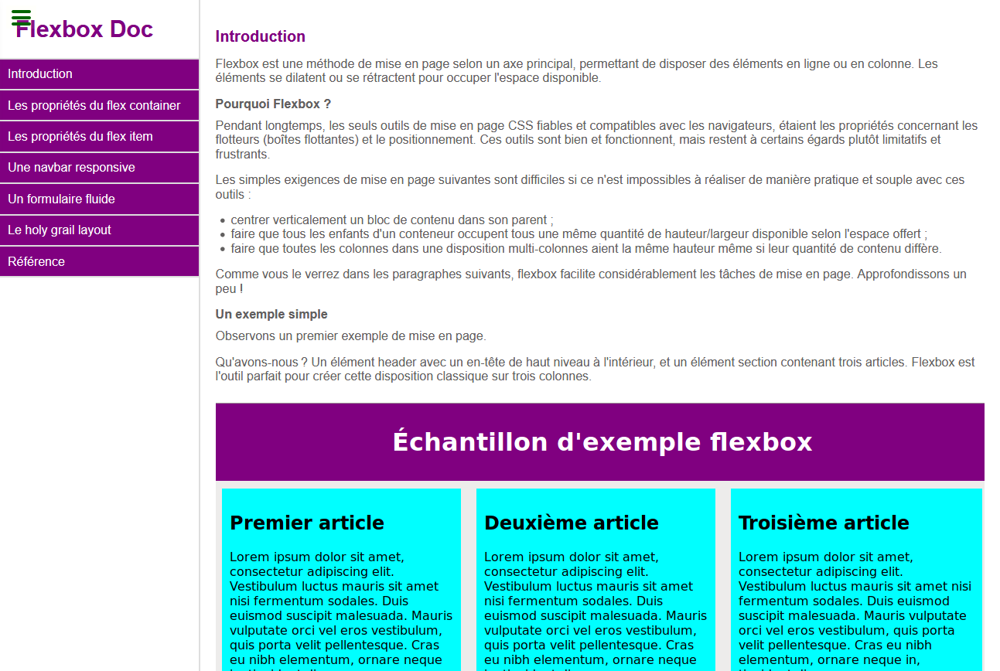

# Survey form

[Voir la démo](https://virginiebouvarel.github.io/breakout/)

> Série: Free Code Camp - RWD Curriculum / Projet 2

> Technos: HTML/CSS

Pour ce deuxième projet du curriculum il s'agissait de créer un formulaire simple avec les champs les plus courants et quelques validation html d'input.
Pas de réelle difficulté technique sur ce projet.

### Design preview 

