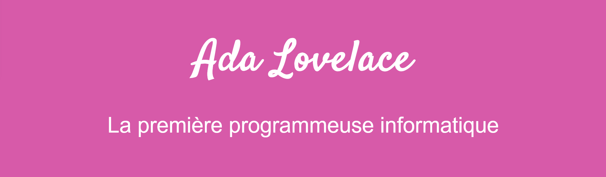

# Ada Lovelace Tribute Page

[Voir la démo](https://virginiebouvarel.github.io/ada_lovelace_tribute_page/)

> Série: Free Code Camp - RWD Curriculum / Projet 1

> Technos: HTML/CSS

Pour ce premier projet du curriculum j'ai voulu rendre hommage à Ada Lovelace, une femme emblématique et à l'aura si incroyable pour son époque, dont j'ai découvert l'existence grâce à l'excellente série Alt 'n catch fire. 

Mon principal défi technique sur ce projet a été de ne pas avoir de maquette à intégrer et de devoir penser absolument chaque détail du visuel à créer.
Sans aucune connaissance en webdesign j'ai pu touché du doigt combien la conception d'une interface belle et fonctionnelle est complexe.

### Design preview

