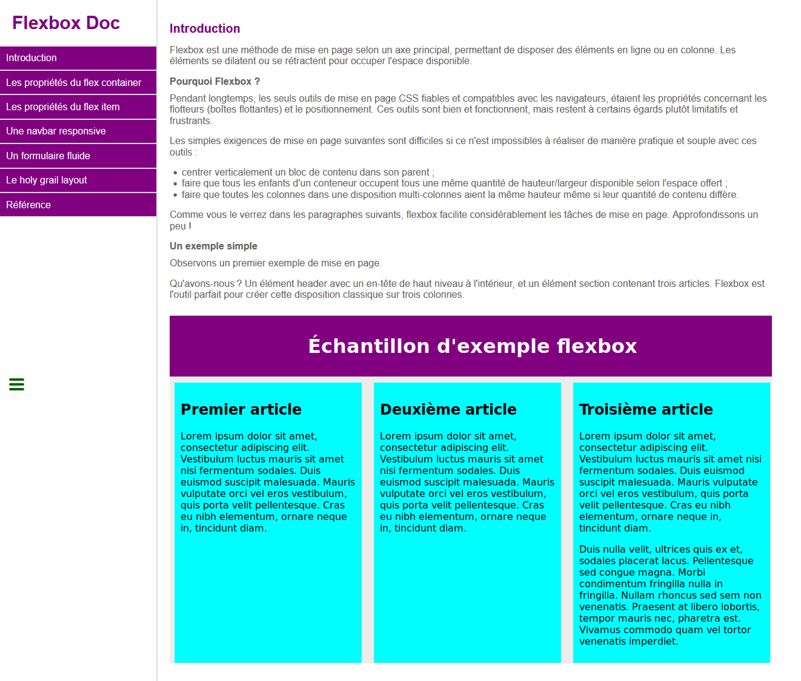

# Technical documentation

[Voir la démo](https://virginiebouvarel.github.io/flexbox_technical_documentation/)

> Série: Free Code Camp - RWD Curriculum / Projet 4

> Technos: HTML/CSS

Pour ce quatrième projet du curriculum il s'agissait de réaliser une mini documentation technique avec un menu en side-bar et le contenu sur la droite. 

Mon challenge pour ce projet a été de parvenir à vraiment bien maîtriser la réalisation d'un menu burger. J'avais déjà réalisé ce type de fonctionnalité par le passé mais toujours en tatonnant. J'ai profité de ce challenge pour tester plusieurs manières de faire et réaliser un petit snippet codepen qui sera réutilisable.   

### Design preview

