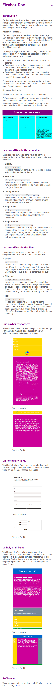
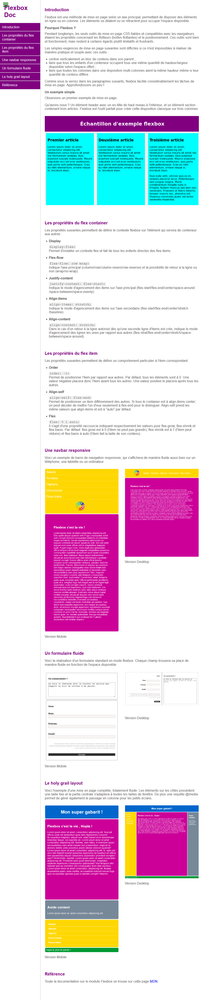

### Live version [here](https://virginiebouvarel.github.io/freecodecamp_curriculum/projet4_techDoc/).

# FreeCodeCamp Curriculum/ Responsive Web Design (300h)
## Projet N°4: Documentation Technique Flexbox
 

 

