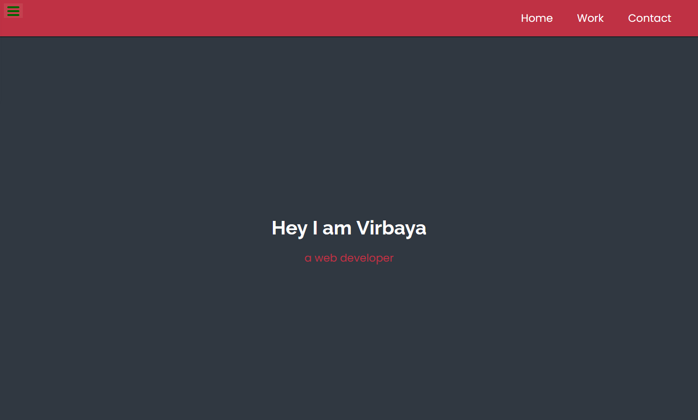

# Fake portfolio

[Voir la démo](https://virginiebouvarel.github.io/fake_portfolio/)

> Série: Free Code Camp - RWD Curriculum / Projet 5

> Technos: HTML/CSS

Pour ce dernier projet du curriculum il s'agissait de réaliser un petit portfolio contenant les projets du curriculum. 

Mon principal défi sur ce projet a été la gestion des images afin de parvenir à présenter des briques de tailles équivalentes en conservant des proportions esthétiques.   

### Design preview

